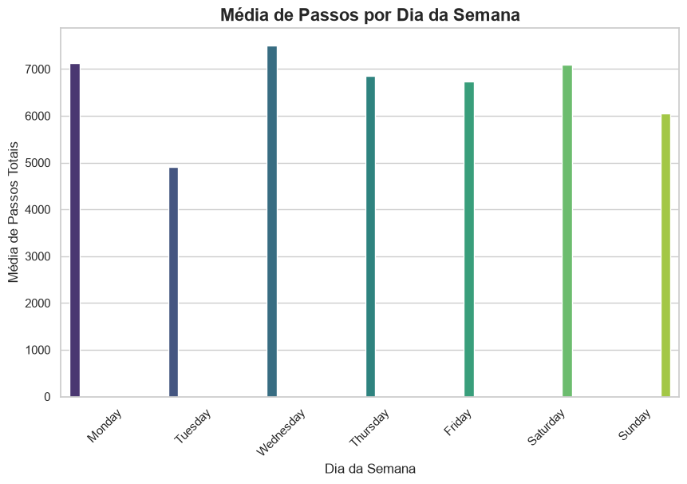

# Estudo-de-Caso-Bellabeat-Python
Análise exploratória de dados de dispositivos inteligentes utilizando Python (Pandas, Matplotlib) para otimizar a estratégia de marketing da Bellabeat. Projeto do Certificado Google Data Analytics.

# 📊 Estudo de Caso Bellabeat: Otimização de Estratégia de Marketing com Python

**Autor:** Fernando Seike Tamura  
**Ferramentas Utilizadas:** Python (Pandas, Matplotlib, Seaborn), Jupyter Notebook, VS Code  
**Área:** Análise de Dados / Inteligência de Negócio  

---

## 📝 Resumo do Projeto
Este projeto é o culminar do **Certificado Profissional Google Data Analytics**. O objetivo principal foi analisar dados históricos de utilização de dispositivos inteligentes não pertencentes à Bellabeat para identificar tendências de comportamento dos consumidores. 

A partir destas descobertas, foram desenhadas estratégias de marketing e de produto direcionadas especificamente para o relógio inteligente **Time**, com o intuito de impulsionar o crescimento da Bellabeat no mercado de bem-estar feminino.

---

## 🔍 As Fases da Análise de Dados

A metodologia aplicada seguiu as 6 fases fundamentais da análise de dados propostas pela Google:

### 1. Perguntar (Ask)
* **Tarefa de Negócio:** Analisar tendências de rotina física em utilizadores de dispositivos inteligentes para orientar campanhas de marketing e desenvolvimento de funcionalidades para o produto *Time* da Bellabeat.
* **Stakeholders Principais:** Urška Sršen (Cofundadora e Diretora de Criação) e Sando Mur (Cofundador e Membro da Equipa Executiva).

### 2. Preparar (Prepare)
* **Fonte de Dados:** [FitBit Fitness Tracker Data](https://www.kaggle.com/datasets/arashnic/fitbit/data) (disponibilizado via Kaggle pelo utilizador MÖBIUS).
* **Organização:** Dados a nível diário, horário e em minutos, documentando métricas como passos, calorias, intensidade e sono.
* **Validação (ROCCC):** Durante a exploração inicial, identificou-se que a amostra era composta por **35 utilizadores únicos** (superando a documentação original que indicava 30), garantindo uma margem ligeiramente maior para extração de tendências.

### 3. Processar (Process)
Todo o processamento e limpeza de dados foi executado em **Python**. O ficheiro principal utilizado foi o `dailyActivity_merged.csv`.
* **Verificação de Qualidade:** Confirmação da ausência de valores nulos (NaN) e remoção/verificação de linhas duplicadas (0 duplicados encontrados).
* **Transformação de Tipos de Dados:** Conversão da coluna `ActivityDate` do formato numérico/texto (`object`) para o formato padrão de data (`datetime64`).
* **Feature Engineering:** Criação de uma nova variável `Dia_da_Semana` para permitir a análise comportamental baseada no calendário semanal.

### 4. Analisar (Analyze)
Os dados foram agregados (`groupby`) para encontrar padrões consistentes no volume de atividade física ao longo da semana.
* **Métricas Analisadas:** Média de Passos Totais (`TotalSteps`) e Média de Calorias Queimadas (`Calories`).
* **Principais Descobertas:**
  * O pico de atividade ocorre à **Quarta-feira** (média de 7.510 passos).
  * A **Terça-feira** apresenta uma quebra abrupta e significativa, registando o volume mais baixo de atividade da semana (média de 4.914 passos), configurando um dia de alto sedentarismo para a amostra.

## 5. Partilhar (Share)
Para comunicar estas descobertas de forma clara à equipa executiva, foi desenvolvida uma visualização de dados com recurso às bibliotecas Matplotlib e Seaborn.

A visualização em gráfico de barras evidencia claramente a disparidade entre a terça-feira e os restantes dias da semana, validando a necessidade de uma intervenção de produto.

### 6. Agir (Act)
Com base na análise técnica, as seguintes recomendações estratégicas foram propostas para o ecossistema Bellabeat, com foco no relógio **Time**:

1. **Notificações Inteligentes "Quebra-Rotina" (Produto):** Implementar um algoritmo no relógio *Time* que detete inatividade prolongada especificamente às terças-feiras, emitindo alertas hápticos (vibração) com mensagens motivacionais para promover caminhadas curtas.
2. **Campanhas de Marketing de Antecipação (Marketing):** Direcionar o orçamento de anúncios digitais (Google Ads, Meta Ads) entre segunda-feira à noite e terça-feira de manhã. A comunicação deve posicionar o relógio *Time* como a ferramenta essencial para combater a quebra de energia a meio da semana.
3. **Gamificação no Ecossistema (Retenção):** Criar desafios semanais na *Bellabeat App*. Se a utilizadora conseguir atingir a "meta de quarta-feira" (7.500 passos) durante a terça-feira, é recompensada com pontos ou vantagens na subscrição premium.

---

## 💻 Como executar este projeto
1. Clone este repositório no seu ambiente local.
2. Certifique-se de que tem o Python instalado, juntamente com as bibliotecas `pandas`, `matplotlib` e `seaborn`.
3. Descarregue o ficheiro `dailyActivity_merged.csv` do Kaggle e coloque-o no mesmo diretório do notebook.
4. Execute o ficheiro `bellabeat_analise.ipynb` no VS Code ou Jupyter Notebook.

---
*Projeto desenvolvido como parte do processo contínuo de especialização em Análise de Dados.*
